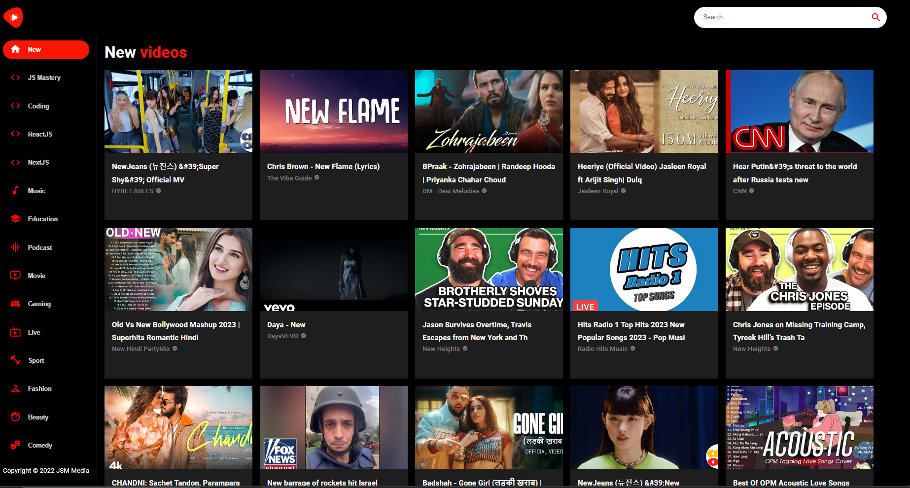
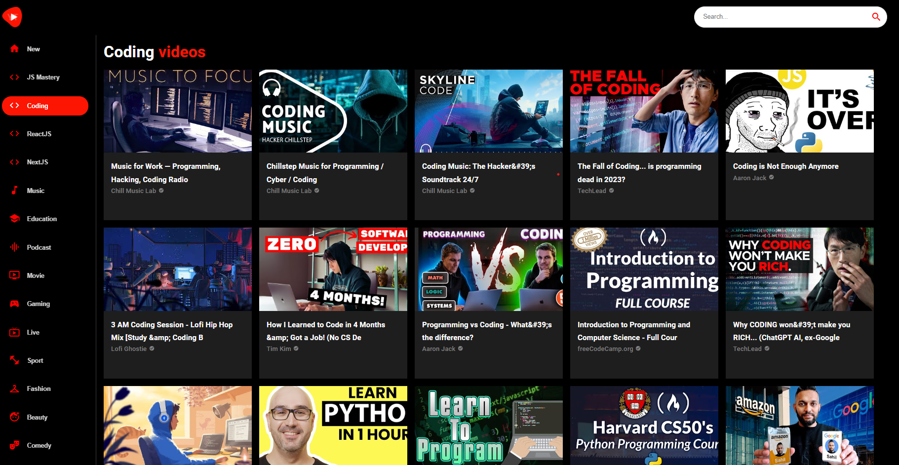
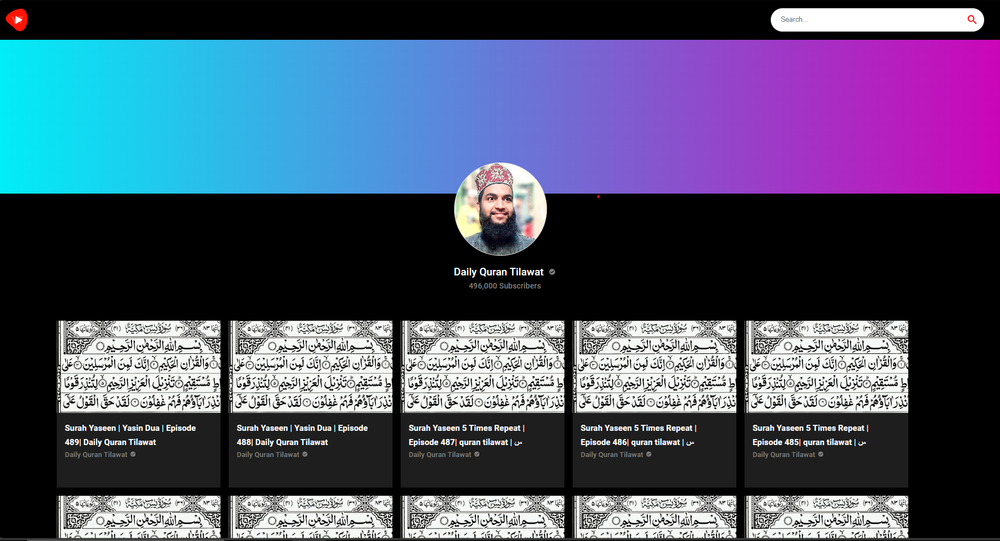
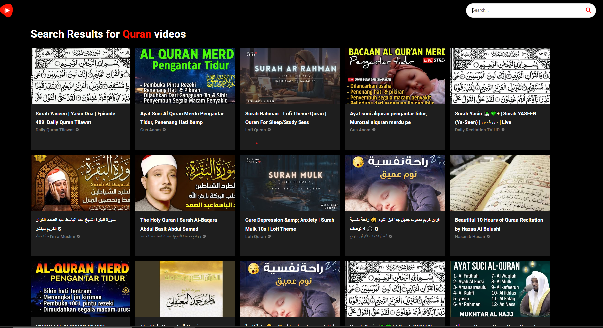

# Youtube-React-Clone V1

## Welcome! 👋

Thanks for checking out this coding challenge.

## The challenge

- Make youtube clone using Reactjs MUI UI Redux Rapid API
- Search Functionality
- Make a Video Page and Channel Page 
- Design a Loader 
- A Sticky Dynamic Navbar
- Responsive Layouts (Mobile, Tablet & Desktop Viewport)
- Add Dynamic SideBar

## Built with

- React js
- MUI UI
- Redux
- React-Router
- Desktop-first workflow
- Axios
- parcel NPM packge mangager

### Design Overview
##### SideBar 
##### Channel Detail 
##### Video Detail 
##### Search 

### Getting Started with App
#### Available Scripts

In the project directory, you can run:

##### `npm start`

Runs the app in the development mode.\
Open [http://localhost:3000](http://localhost:3000) to view it in your browser.

The page will reload when you make changes.\
